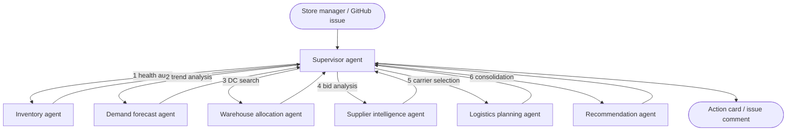

# Walmart Smart Inventory and Restocking Assistant


A multi-agent system that automates retail restocking decisions: it audits
store inventory, forecasts demand, weighs warehouse transfers against
supplier orders, plans logistics, and hands the store manager one
explainable recommendation.

Every agent is deterministic and rule based. There is no LLM in the loop, no
API key to configure and no cost per run, which is what makes the chatbot
below possible on plain GitHub Actions.

## Ask the assistant on GitHub

The repository is the chatbot. Open an issue (or comment on one) with a
question in plain text, and a GitHub Actions job runs the full multi-agent
pipeline and posts the recommendation as a comment, typically in under a
minute.

| Ask | Example |
|---|---|
| Analyze a product at a store | `analyze bottled water at store 1001` |
| Same, by IDs | `restock Prod_003 at Store_1002` |
| Store stock health overview | `status of store 1004` |
| Run a demo scenario | `run scenario 2` |
| List known stores and products | `list products` |
| Usage guide | `help` |

A reply looks like this:

> ### Purified Bottled Water 40-Pack at Store_1001
> | Stage | Result |
> |---|---|
> | Stock health | **CRITICAL_UNDERSTOCK** (0 on hand, threshold 50) |
> | Demand forecast | 318 units over 7 days (SPIKE), reorder 381 |
> | Warehouse | Dallas DC: transfer 381 units, 1.2 days |
> | Logistics | EXPRESS_MOTOR, ETA 0.9 days |
>
> **Recommendation: TRANSFER** ... confidence, risk and savings figures,
> plus the full agent execution log in a collapsible section.

Use the "Ask the restocking assistant" issue template to get started, or
run the same brain locally:

```bash
python -m chatbot.bot "analyze smart tv at store 1003"
```

## How it works

A supervisor agent routes work through six specialists and skips whatever
the situation does not need (stable stock goes straight to the
recommendation; a warehouse that covers the full order skips the supplier
step; critical shortages escalate the transport mode).



| Agent | Responsibility | Rules applied |
|---|---|---|
| Supervisor | Routes the workflow, applies shortcuts, tracks the audit log | State machine |
| Inventory | Classifies stock health: stable, understock, critical, overstock | Threshold boundaries |
| Demand | Projects demand from sales history, promotions and seasonality | Moving averages plus surge multipliers |
| Warehouse | Finds the nearest distribution center with stock | Proximity and transfer cost |
| Supplier | Scores vendors on lead time, reliability and unit cost | Weighted cost vs speed matrix |
| Logistics | Picks ground, express or air freight and estimates the ETA | Distance and urgency rules |
| Recommendation | Consolidates everything into one action with confidence, risk and savings | Cost avoidance analytics |

State is a typed Pydantic model (`memory/state_manager.py`) that every agent
reads and extends, so each run carries a complete, inspectable audit trail.

## Quick start

```bash
git clone https://github.com/ShreyasThakur11/walmart-agentic-ai.git
cd walmart-agentic-ai
python -m venv .venv && source .venv/bin/activate   # Windows: .venv\Scripts\activate
pip install -r requirements.txt

pytest tests/ -q          # 18 tests: agents, workflow, tools, chatbot
streamlit run app.py      # dashboard at http://localhost:8501
```

Or with Docker:

```bash
docker build -t walmart-agentic-ai .
docker run -p 8501:8501 walmart-agentic-ai
```

The `data/` folder ships with a synthetic dataset (5 stores, 8 products,
8 distribution centers, supplier quotes, 30 days of sales). Regenerate it
any time with `python tools/data_generator.py`.

## Demo scenarios

| # | Situation | What the supervisor does |
|---|---|---|
| 1 | Pre-festival bottled water spike | Demand agent projects a 3.5x surge; nearest DC covers it with a rapid ground transfer |
| 2 | Warehouse stock outage | Zero DC stock detected; routes to the supplier agent and escalates to air cargo |
| 3 | Supplier lead time delay | Long vendor lead time flagged; shipping mode upgraded, speed-weighted supplier scoring |
| 4 | Post-promotion spike | Limited DC stock; the restock is split between a transfer and a supplier order |
| 5 | Multi-store contention | Two stores need the same product; each gets an independent sourcing plan |

Run them from the dashboard sidebar, or ask the chatbot: `run scenario 4`.

## Repository layout

```
agents/            supervisor and the six specialist agents
chatbot/           the GitHub issue chatbot (same pipeline, markdown replies)
memory/            typed workflow state and audit log
tools/             CSV data access, business rules, data generator
prompts/           agent persona and rule documentation
data/              synthetic inventory, sales, warehouse, supplier, transport data
tests/             pytest suite covering agents, workflow, tools and chatbot
app.py             Streamlit operations dashboard
.github/workflows  ci.yml (tests) and chatbot.yml (issue-driven assistant)
```

## Extending it

- Point `tools/db_tools.py` at a real ERP or inventory database instead of CSVs
- Swap the moving-average forecast for an ML model behind the same interface
- Add weather or traffic feeds to sharpen the logistics ETAs
- Connect the recommendation agent to a purchase-order API to close the loop

## License

MIT. See [LICENSE](LICENSE).
