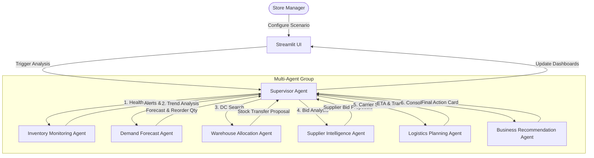

# Walmart Smart Inventory & Restocking Assistant (v1.0)
> **An Enterprise Multi-Agent AI Platform for Intelligent Inventory Monitoring, Demand Prediction, and Automated Restocking.**

---

## 📋 Executive Summary
Maintaining optimal retail inventory levels is a major challenge for Walmart stores globally. Overstocking inflates holding costs and wastes valuable shelf space, while understocking (stockouts) directly reduces sales volume and damages customer satisfaction.

The **Walmart Smart Inventory & Restocking Assistant** is a production-grade multi-agent AI system designed to automate stockout detection, predict demand surges, evaluate supply options (regional warehouses vs. external commercial suppliers), select shipping modes, and deliver explainable decision recommendation reports to store managers.

---

## 🎯 Business Problem & Context
Walmart operates thousands of retail locations worldwide. When shelf inventory falls below safety levels, restocking managers must manually cross-reference data from multiple distinct IT systems:
1.  **Inventory Records**: Current stock levels and thresholds.
2.  **Sales History**: Recent velocity, active promotions, and seasonal demand.
3.  **Distribution Center (DC) Stock**: Nearby warehouse inventory.
4.  **Vendor / Supplier Lead Times**: Order lead times, unit costs, and delivery reliability.
5.  **Logistics Network**: Freight cost, carrier availability, and travel distances.

This manual process is slow, prone to errors, and involves multiple supply-chain departments.

---

## 🤖 Why Agentic AI?
Traditional rule-based algorithms or single chatbot LLMs cannot coordinate these complex, dynamic business functions effectively. 

This platform implements a **Supervisor Agent Pattern** utilizing a dynamic state machine that orchestrates specialized AI agents:
*   Each agent owns a single operational domain (e.g., Inventory, Demand, Warehouse, Supplier, Logistics).
*   The **Supervisor Agent** coordinates the flow, making dynamic routing decisions based on real-time data states (e.g., bypassing suppliers if warehouse transfers fully satisfy demand, escalating to express air cargo when critical stockouts are detected).

---

## 📐 Architecture & Supervisor Pattern

The supervisor evaluates the outputs of each agent dynamically:



---

## 🧩 Specialized Agent Descriptions

| Agent Name | Operational Persona | Key Responsibility | Business Rules Applied |
| :--- | :--- | :--- | :--- |
| **Supervisor Agent** | Chief SCM Coordinator | Decides workflow transitions, updates state logs, manages retry paths, and coordinates specialized sub-agents. | State Machine Router |
| **Inventory Monitoring Agent** | Store Auditor | Reads local stock and categorizes health as Stable, Understock, Critical Understock, or Overstock. | Warnings & Threshold Boundaries |
| **Demand Forecast Agent** | Business Analyst | Evaluates sales history and projects demand based on seasons, promotions, and holidays. | Multi-day Moving Averages + Surge Multipliers |
| **Warehouse Allocation Agent** | Logistics Allocator | Queries regional distribution centers and finds the nearest stock available for transfer. | Proximity-based Transit Computations |
| **Supplier Intelligence Agent** | Procurement Specialist | Queries external vendors, comparing lead times, unit costs, and supplier reliability ratings. | Weighted Cost-vs-Speed Bidding Matrix |
| **Logistics Planning Agent** | Fleet Scheduler | Assigns transit methods (Standard Ground, Express Motor, Air Cargo) and estimates travel schedules. | Dynamic Speed & Distance Logistics Rules |
| **Business Recommendation Agent** | Chief Restocking Advisor | Synthesizes sourcing outputs into a final actionable plan, calculating savings, confidence, and stockout risk. | Risk and Cost Avoidance Analytics |

---

## 📂 Folder Structure
```
walmart-agentic-ai/
├── app.py                      # Main Streamlit web application
├── config.py                   # Global configuration, logger, constants
├── requirements.txt            # Package dependencies
├── Dockerfile                  # Containerization template
├── README.md                   # Enterprise README documentation
├── LICENSE                     # MIT License
├── .gitignore                  # Git exclusions
├── .env.example                # Example environment variables
├── agents/                     # Specialized decision agents
│   ├── base_agent.py           # Abstract Base Agent definitions
│   ├── supervisor.py           # Supervisor agent (state & orchestrator)
│   ├── inventory_agent.py      # Inventory analysis
│   ├── demand_agent.py         # Demand forecasting
│   ├── warehouse_agent.py      # Warehouse inventory matching
│   ├── supplier_agent.py       # Supplier evaluation
│   ├── logistics_agent.py      # Transit & cost calculation
│   └── recommendation_agent.py # Recommendation consolidation
├── tools/                      # Data utility functions
│   ├── db_tools.py             # CSV Database queries
│   └── rules_engine.py         # Pre-defined business rules
│   └── data_generator.py       # Synthetic CSV records generator
├── memory/                     # State and conversation tracking
│   └── state_manager.py        # Application state container
├── data/                       # CSV Datasets
│   ├── inventory.csv
│   ├── warehouse.csv
│   ├── supplier.csv
│   ├── sales_history.csv
│   └── transportation.csv
├── prompts/                    # Prompts used by agents
│   └── templates.py
├── logs/                       # Application logs directory
│   └── execution.log
└── tests/                      # Automated test suite
    ├── test_agents.py
    ├── test_workflow.py
    └── test_tools.py
```

---

## ⚙️ Installation & Running Locally

### Prerequisites
*   Python 3.12 (or newer)
*   Virtual environment tools (`venv` or `uv`)

### 1. Set Up the Project
Clone the repository and navigate to the project root:
```bash
git clone https://github.com/walmart-global-tech/walmart-agentic-ai.git
cd walmart-agentic-ai
```

### 2. Configure Virtual Environment & Install Dependencies
Create a virtual environment and install packages:
```bash
# Using standard Python
python -m venv .venv
source .venv/bin/activate  # On Windows: .venv\Scripts\activate
pip install -r requirements.txt

# Or using uv (recommended for 10x speed)
uv venv
uv pip install -r requirements.txt
```

### 3. Generate Datasets
Initialize the synthetic business data:
```bash
python tools/data_generator.py
```

### 4. Run Automated Tests
Verify that all agents and state-routing rules pass validation:
```bash
pytest tests/
```

### 5. Start the Operations Dashboard
Launch the Streamlit interface locally:
```bash
streamlit run app.py
```
Open your browser at `http://localhost:8501`.

---

## 🐳 Running with Docker

Build the Docker image:
```bash
docker build -t walmart-agentic-ai .
```

Run the container:
```bash
docker run -p 8501:8501 walmart-agentic-ai
```

---

## 🎯 Demonstration Guide (Demo Scenarios)

The dashboard contains a **Demo Mode** in the sidebar that allows running predefined restocking scenarios:

1.  **Scenario 1: Pre-Festival Bottled Water Spike**
    *   *Situation*: Low stock on Bottled Water. Demand agent predicts a 3.5x sales spike due to an upcoming regional festival.
    *   *Decision*: Supervisor routes to Warehouse Agent, which finds plenty of stock in the nearby Dallas DC. Arranges a rapid ground transfer.
2.  **Scenario 2: Warehouse Stock Outage**
    *   *Situation*: Stock of Allergy Relief Cetirizine is critical. Warehouses have 0 inventory.
    *   *Decision*: Supervisor detects 0 warehouse availability, bypasses warehouse transfer, and routes to Supplier Agent. Supplier Agent selects the most reliable pharmaceutical vendor.
3.  **Scenario 3: Supplier Lead Time Delay**
    *   *Situation*: Low stock on Smart TVs. Warehouses are empty. Primary supplier has a long lead time (14 days).
    *   *Decision*: Logistics agent identifies the delay threat, elevates shipping mode to **AIR_CARGO**, and recommend dual-sourcing options to prevent stockouts.
4.  **Scenario 4: Post-Promotion Spike**
    *   *Situation*: Outdoor Patio Furniture stock is depleted after a summer flyer discount event.
    *   *Decision*: Warehouse stock is limited, so the Supervisor splits the restock: a partial transfer from the nearest warehouse and a supplier order to build safety stock buffer.
5.  **Scenario 5: Multi-Store Resource Contention**
    *   *Situation*: Stores 1001 and 1005 both report low Organic Milk stock. Warehouse has limited supply.
    *   *Decision*: Supervisor allocates warehouse stock to the priority store and schedules a supplier replenishment order for the second store to balance supply across the region.

---

## 🔮 Future Roadmap
The system is architected as a modular state orchestrator, making it easy to integrate:
*   **ERP Systems**: Connect `db_tools.py` directly to SAP or Oracle SCM tables.
*   **Physical Sensors**: Stream real-time inventory levels from RFID shelf readers.
*   **External APIs**: Fetch weather maps or traffic data to modify logistics travel forecasts.
*   **ML Forecasting Models**: Replace simple moving average forecasting with deep neural network predictors.

---

## 📄 License
This project is licensed under the MIT License - see the [LICENSE](file:///C:/Users/thaku/.gemini/antigravity-ide/scratch/walmart-agentic-ai/LICENSE) file for details.
